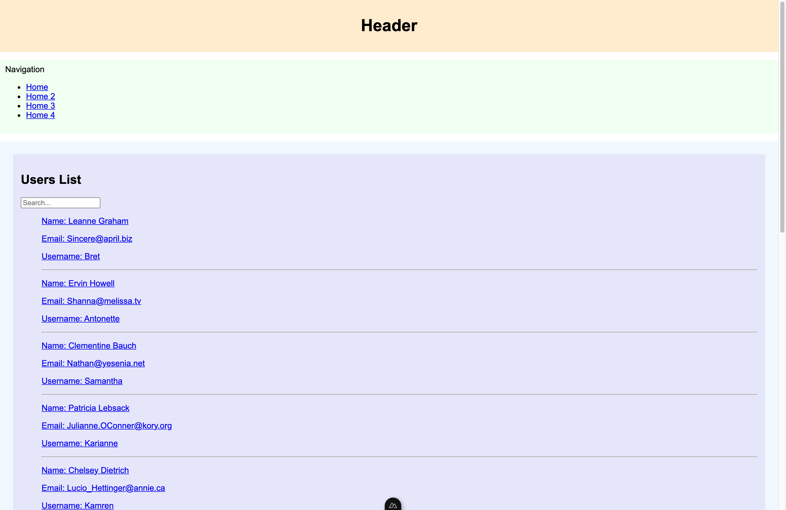
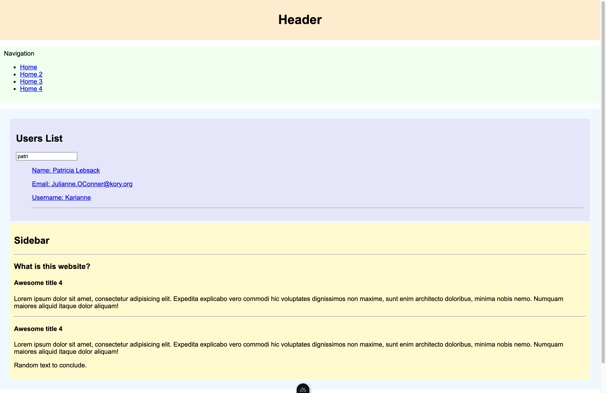
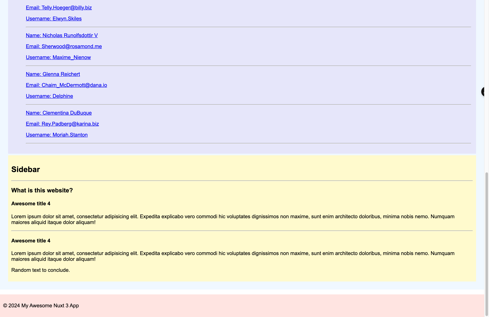
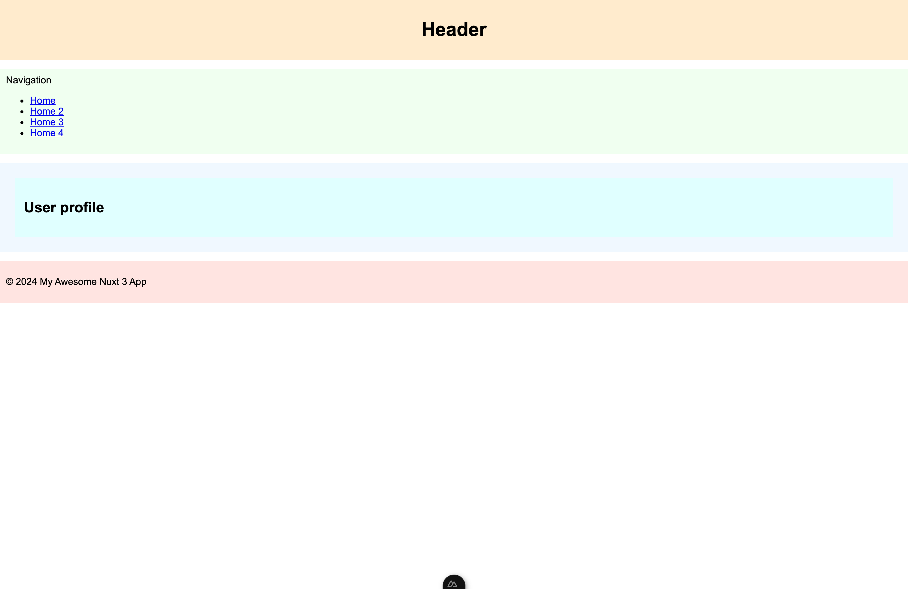
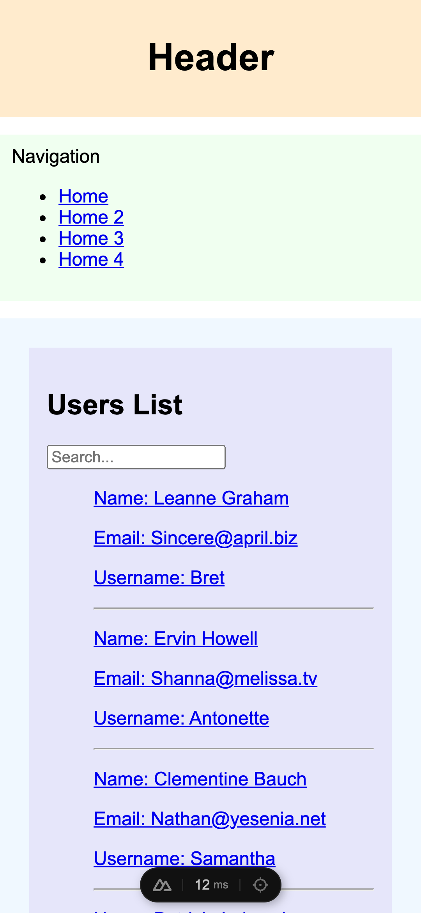
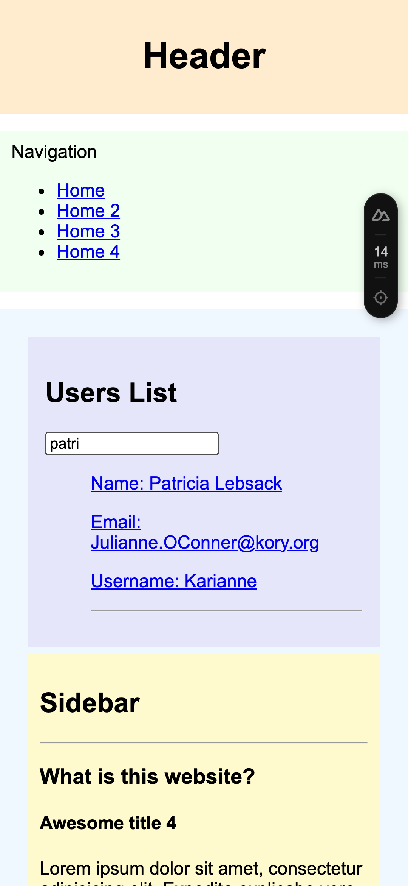
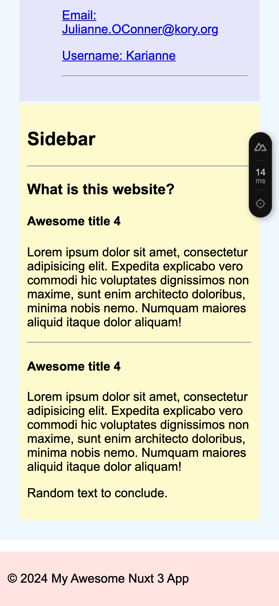
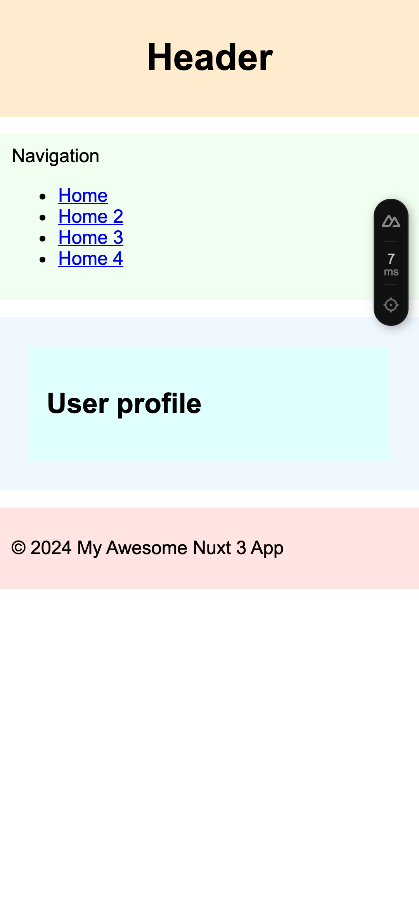

# Frontend Coding Challenge

This project is a basic Nuxt 3 (https://nuxt.com/docs/getting-started/introduction) project which uses some free API data to fetch a list of users and display their information in a list.

By clicking on one of the list's element, we are redirected to the user's profile, which misses the call to the user information at the moment.

The website is voluntarily not well-designed and you don't have to work on this part.

## Tasks

1. Change the current layout to bring some responsive behaviour. Only implement a single solution, but try to think of different solutions that could be used to achieve responsiveness.
2. Implement the call to the user's information when redirected to their profile by using the `id` parameter present in the route (you will use the endpoint https://jsonplaceholder.typicode.com/users/{id}) and a Nuxt built-in hook (https://nuxt.com/docs/getting-started/data-fetching).
3. Display a few information, but do not add any styling. Change the Nuxt configuration to behave in SPA (single-page-application) mode, and compare the behavior when previously using the SSR (server-side-rendering - default mode) mode.

The code will then need to be present in a public repository and you will provide us the GitHub link when you are done with it.

## Goal

The goal of the exercise is not to invest too much time to search or implement the perfect solution but rather to discuss the pros and cons of the different approaches to implement a responsive behavior and how a SSR and SPA differ.

There are no right or wrong answers.

Therefore, please try to not:

- Add too many extra elements
- Add too many extra styling

Feel free to ask any questions if anything is not clear!

## Setup

Install the dependencies:

```bash
# npm or pnpm or yarn or
npm install

# pnpm
pnpm install

# yarn
yarn install

# bun
bun install
```

Start the development server on `http://localhost:3000`:

```bash
# npm
npm run dev

# pnpm
pnpm run dev

# yarn
yarn dev

# bun
bun run dev
```

## Initial views

### Desktop

| Home                                                                                   | Home filter                                                                                          |
| -------------------------------------------------------------------------------------- | ---------------------------------------------------------------------------------------------------- |
|  |  |

| Home Footer                                                                                          | User Profile                                                                                           |
| ---------------------------------------------------------------------------------------------------- | ------------------------------------------------------------------------------------------------------ |
|  |  |

### Mobile

| Home                                                                              | Home filter                                                                                     | Home Footer                                                                                     | User Profile                                                                                      |
| --------------------------------------------------------------------------------- | ----------------------------------------------------------------------------------------------- | ----------------------------------------------------------------------------------------------- | ------------------------------------------------------------------------------------------------- |
|  |  |  |  |
